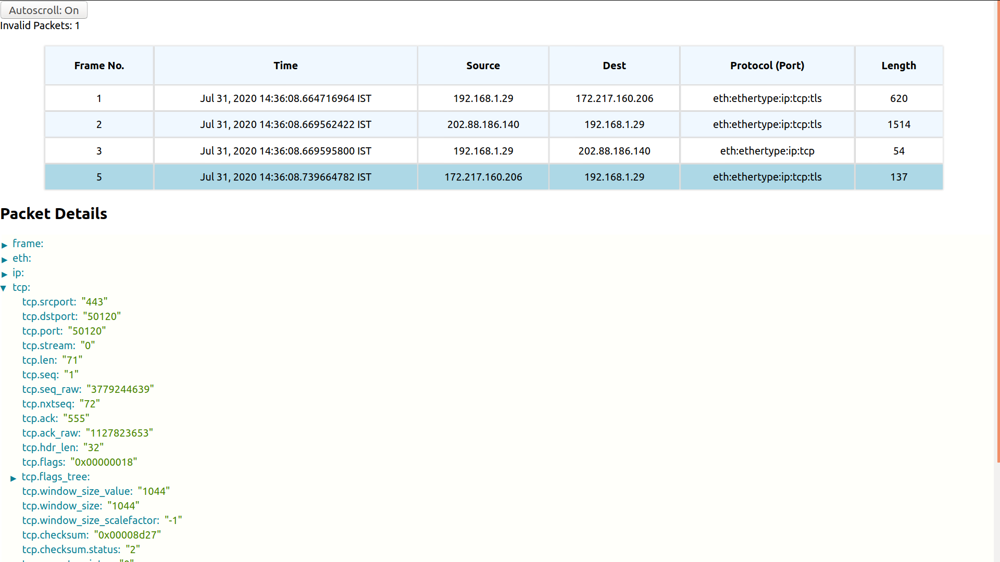

# Pkt Trail React Demo App

Demonstrates PktTrail component usage from [`pkt-trail-react`](https://github.com/hyphenOs/pkt-trail-react.git) library

## Getting Started

- `yarn install` to install all dependencies
- Provide `packets` (array) prop to `PktTrail` component (each packet should be JSON.stringified)
- `yarn start` to run the app on local server
