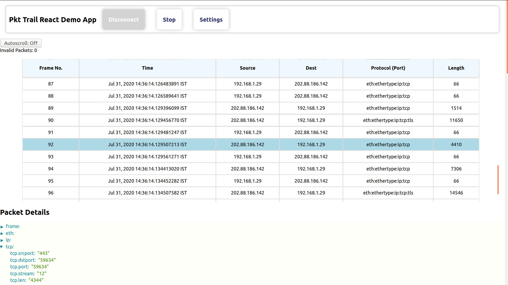

Pkt Trail React Demo App
========================

Demonstrates PktTrail component usage from `pkt-trail-react <https://github.com/hyphenOs/pkt-trail-react.git>`_ library

Getting Started
---------------

To be able to 'use' demo application started, you will need to complete following three steps -

1. Start the demo app (this repository)
2. Start Packet Trail Websocket Server `from this repository <https://github.com/hyphenOs/pkt-trail-ws-server>`_. Follow the README file.
3. (optional) Start Redis example from `Wishpy Examples Repository <https://github.com/hyphenOs/wishpy-examples>`_. Follow the README file.

Starting Demo Application
~~~~~~~~~~~~~~~~~~~~~~~~~

- ``yarn install`` to install all dependencies
- Provide ``packets`` (array) prop to ``PktTrail`` component (each packet should be JSON.stringified)
- ``yarn start`` to run the app on local server

Starting Packet Trail Websocket Server
~~~~~~~~~~~~~~~~~~~~~~~~~~~~~~~~~~~~~

This demo application receives packets from the websocket server (See 2. getting started!). If the Websocket server is not started, you will see an error when trying to 'Connect'. Start the Server first.

Live Capture and Redis Push
~~~~~~~~~~~~~~~~~~~~~~~~~~~

To be able to see the application see live data from your network interface, you will have to start the Redis example. (See 3. above in Getting Started.)

Known Issues
~~~~~~~~~~~~

Right now the ``PktTrail`` React component uses ``localStorage`` for packet storage. This is limited to 5MB, so you will get an error after approximately 1000 Packets or so! You will have to connect again and re-start!

